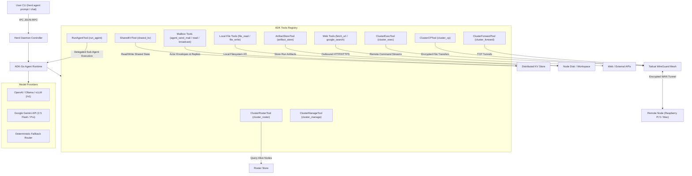
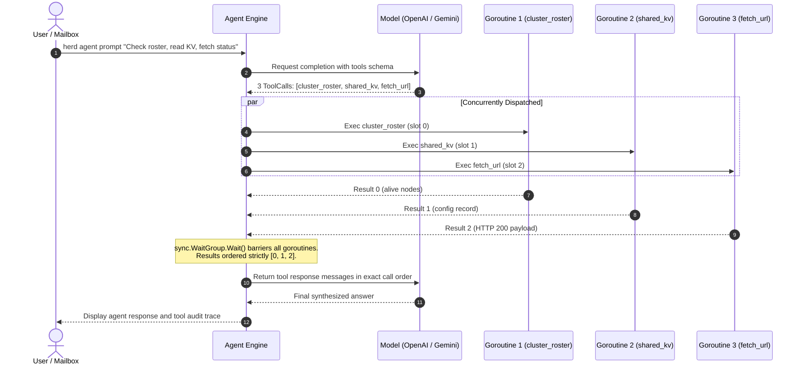

# Google ADK-Go Integration

Specification and design for embedding Google's Gemini Go SDK (`google.golang.org/genai`) directly into Herd to form a decentralized autonomous agent mesh. The implementation uses the Gemini Go SDK, not an ADK package.

See also:
- [Architecture Overview](architecture.md)
- [Actor-Style Mailbox Subsystem](mailbox.md)
- [Unified Logging Architecture](logging.md)
- [CLI Commands Reference](commands.md)
- [Protocol Specification](protocol.md)
- [Distributed KV Guide](distributed-kv.md)

---

## 1. Vision: Decentralized Agentic Mesh

Herd transforms from a passive infrastructure mesh into an autonomous agent mesh where **every cluster node runs an embedded AI agent**.

Each Node Agent:
1. Represents its local machine (Cloud VM, Raspberry Pi 5, Apple Silicon Mac).
2. Has access to cluster-wide tool primitives (Roster discovery, Tailcat remote execution, Distributed KV, Actor Mailbox, and Web grounding).
3. Can collaborate with peer node agents over encrypted Tailcat WireGuard connections.



---

## 2. ADK Tools Registry

The agent runtime is equipped with Go functions implementing the ADK Tool interface:

### 2.1 `ClusterRosterTool` (`cluster_roster`)
- **Purpose**: Allows the agent to inspect cluster membership, alive nodes, Tailcat endpoints, and latencies.
- **Input Parameters**:
  - `filter_status` (`string`): Optional filter by status (`alive`, `suspect`, `all`). Default: `alive`.
- **Return Data**: JSON array of active nodes with metadata.

### 2.2 `ClusterExecTool` (`cluster_exec`)
- **Purpose**: Enables the agent to run arbitrary shell commands on any node in the cluster (or all nodes) over Tailcat encrypted streams. Subject to `agent:policy:allowed_exec` whitelist.
- **Input Parameters**:
  - `target` (`string`): Target node name (e.g. `node-2`, `node-1`, or `all`).
  - `command` (`string`): Shell command to execute.
  - `timeout_seconds` (`int`): Optional execution timeout (default: 30s).
- **Return Data**: JSON object with `stdout`, `stderr`, `exit_code`, and error messages.

### 2.3 `ClusterCPTool` (`cluster_cp`)
- **Purpose**: Enables agents to transfer files directly across nodes over encrypted multiplexed file streams.
- **Input Parameters**:
  - `src` (`string`): Source file path (e.g. `/tmp/report.txt` or `node-1:/var/log/syslog`).
  - `dst` (`string`): Destination file path (e.g. `/tmp/dest.txt` or `node-2:/tmp/report.txt`).
- **Return Data**: JSON object with transfer success status, bytes transferred, and message.

### 2.4 `SharedKVTool` (`shared_kv`)
- **Purpose**: Allows agents to persist and retrieve shared knowledge, status reports, and coordination locks across the cluster.
- **Input Parameters**:
  - `action` (`string`): `"get"`, `"set"`, `"delete"`, or `"list"`.
  - `key` (`string`): Key identifier (e.g. `agent:memory:incidents/high-cpu`).
  - `value` (`string`): Value to store (for `"set"`).
  - `ttl` (`string`): Optional TTL expiration (e.g. `"1h"`, `"24h"`).
- **Return Data**: Found status, entry value, version, and timestamps.

### 2.5 `AgentSendMailTool` (`agent_send_mail`)
- **Purpose**: Sends an actor-style message or task request into a target mailbox (`mailbox:<target>/<msg_id>`) with thread tracking and TTL.
- **Input Parameters**:
  - `to` (`string`): Destination address (node name, role, or `*` broadcast).
  - `topic` (`string`): Message topic / category (e.g. `task`, `audit`, `db_query`).
  - `message` (`string`): Message payload or task description.
  - `thread_id` (`string`): Optional conversation thread ID.
  - `ttl` (`string`): Message expiration duration (default: `"1h"`).
- **Return Data**: Generated message ID, destination key, and queued timestamp.

### 2.6 `AgentBroadcastTool` (`agent_broadcast`)
- **Purpose**: Publishes an event message to all node agents across the mesh (`mailbox:*/<msg_id>`).
- **Input Parameters**:
  - `topic` (`string`): Broadcast topic name.
  - `message` (`string`): Announcement content.
  - `ttl` (`string`): Message expiration (default: `"30m"`).
- **Return Data**: Broadcast message ID and delivery status.

### 2.7 `AgentReadMailboxTool` (`agent_read_mailbox`)
- **Purpose**: Reads, processes, and acknowledges pending messages waiting in the local or target mailbox (`mailbox:<target>/*`).
- **Input Parameters**:
  - `target` (`string`): Optional mailbox target (defaults to local node).
  - `ack` (`bool`): If true, clears consumed messages from the mailbox.
  - `topic` (`string`): Optional topic filter.
- **Return Data**: List of message envelopes with sender, topic, payload, thread ID, and timestamps.

### 2.8 `FetchURLTool` (`fetch_url`)
- **Purpose**: Retrieves content from an HTTP or HTTPS URL, strips HTML tags/scripts, and returns clean text or JSON content for grounding.
- **Input Parameters**:
  - `url` (`string`): The complete HTTP/HTTPS URL to fetch.
  - `max_bytes` (`int`): Optional maximum bytes to read (default: 65536, max: 524288).
- **Return Data**: Status code, content type, parsed text content, and byte length.

### 2.9 `GoogleSearchTool` (`google_search`)
- **Purpose**: Searches the web for real-time external grounding, technical documentation, and error resolution. Supports Google Custom Search API or local mock fallback.
- **Input Parameters**:
  - `query` (`string`): The search query keywords.
  - `num_results` (`int`): Optional number of search results to return (default: 5, max: 10).
- **Return Data**: List of search results with title, link snippet, and URL.

### 2.10 `FileReadTool` (`file_read`)
- **Purpose**: Direct local filesystem reading on the current node with line offset and count limit (safety capped at 10MB to prevent memory exhaustion).
- **Input Parameters**:
  - `path` (`string`): Target file path.
  - `offset_lines` (`int`): 1-based start line (default: 1).
  - `max_lines` (`int`): Max lines to return (default: 1000, max: 10000).
- **Return Data**: JSON object with cleaned `path`, `total_lines`, `offset_lines`, `returned_lines`, and `content`.

### 2.11 `FileWriteTool` (`file_write`)
- **Purpose**: Direct local filesystem writing with automatic parent directory creation, overwrite control, and append mode.
- **Input Parameters**:
  - `path` (`string`): Target file path.
  - `content` (`string`): Text content to write.
  - `append` (`bool`): If true, append instead of overwrite (default: `false`).
  - `overwrite` (`bool`): If false and file exists without append, returns error (default: `true`).
- **Return Data**: JSON object with `path`, `bytes_written`, and `status` (`created`, `overwritten`, or `appended`).

### 2.12 `ArtifactStoreTool` (`artifact_store`)
- **Purpose**: Manages multi-turn execution artifacts (documents, code patches, analysis reports, run logs) on the local node under `~/.local/share/herd/<node>/artifacts/` without polluting structured KV gossip.
- **Input Parameters**:
  - `action` (`string`): One of `"store"`, `"get"`, `"list"`, or `"delete"`.
  - `name` (`string`): Artifact identifier (required for `store`, `get`, `delete`).
  - `content` (`string`): Content string (required for `store`).
  - `metadata` (`object`): Optional key-value metadata tags.
- **Return Data**: Artifact contents, size, creation/update timestamps, and metadata tags.

### 2.13 `ClusterForwardTool` (`cluster_forward`)
- **Purpose**: Dynamically establishes, lists, or stops bidirectional TCP port forwarding tunnels across mesh nodes over encrypted Tailcat streams.
- **Input Parameters**:
  - `action` (`string`): `"start"`, `"stop"`, or `"list"`.
  - `local_port` (`int`): Local port to bind listener to (required for `start`).
  - `target_node` (`string`): Target node name or address (required for `start`).
  - `target_port` (`int`): Remote port on the target node (required for `start`).
  - `bind_host` (`string`): Local IP interface to bind to (default: `127.0.0.1`).
  - `id` (`string`): Tunnel identifier to stop (required for `stop` if `local_port` omitted).
- **Return Data**: Tunnel status, tunnel ID, listening address, and uptime.

### 2.14 `ClusterManageTool` (`cluster_manage`)
- **Purpose**: Allows agents to inspect node/daemon health, join peer addresses dynamically, or initiate graceful leaves.
- **Input Parameters**:
  - `action` (`string`): `"status"`, `"join"`, or `"leave"`.
  - `address` (`string`): Peer address or endpoint to join (required for `join`).
- **Return Data**: Daemon status (uptime, member count, Tailcat addr), joined peer count, or leave confirmation.

### 2.15 `RunAgentTool` (`run_agent`)
- **Purpose**: Generic agent invocation primitive implementing Google ADK's `AgentTool` pattern. Allows any agent or persona to execute an isolated task prompt against any other agent without hardcoded role hierarchies.
- **Input Parameters**:
  - `agent` (`string`): Target agent name or persona to invoke (e.g. `ops`, `researcher`, or custom persona).
  - `prompt` (`string`): Task prompt or evaluation instruction.
  - `context` (`string`): Optional contextual background data.
- **Return Data**: Sub-agent `response`, `model_used`, `execution_ms`, and `tools_called`.

---

## 3. Parallel Tool Execution Architecture

During multi-step reasoning, models frequently produce multiple independent tool requests in a single turn (e.g. querying status from 4 nodes or running multiple KV queries concurrently).

Herd's agent engine executes all tool calls within a reasoning turn concurrently using bounded goroutines and deterministic pre-allocated indexed slices:



### Key Concurrency Invariants:
1. **Pre-allocated Indexed Slices**: Each goroutine writes only to its designated index `idx` in `results := make([]execResult, len(toolCalls))`. This guarantees zero lock contention and eliminates channels.
2. **Deterministic History Preservation**: Tool output messages returned to the LLM precisely match the order emitted by the model, preventing non-deterministic prompt drifting or token mismatch.
3. **Execution Wall-Clock Savings**: Total turn execution time drops from `O(N * Latency)` to `O(max(Latency))`.

---

## 4. Declarative Markdown Agents & Role-Based Scoped Toolsets

Herd supports defining autonomous agent personas and scoped toolsets declaratively via **Markdown files with YAML frontmatter** (`AGENTS.md` and `*.agent.md`).

### 4.1 Specification & YAML Frontmatter Schema

Each markdown agent file defines an agent persona, model requirements, temperature, scoped tools, and a markdown system prompt:

```markdown
---
name: cluster-researcher
role: researcher
description: Deep web and cluster intelligence gathering specialist
model: gemini-3.8-flash
provider: gemini
temperature: 0.2
tools:
  - google_search
  - fetch_url
  - shared_kv
---
# Researcher Persona Instructions

You are an expert research agent embedded in the Herd cluster mesh.
Your primary objective is to search documentation, fetch remote endpoint status,
and persist structured intelligence into the cluster's distributed KV store.

Always verify facts using `google_search` before storing conclusions in `shared_kv`.
```

#### Frontmatter Attributes:

| Field | Type | Description |
| :--- | :--- | :--- |
| `name` | `string` | Unique agent identifier (e.g. `cluster-researcher`, `ops-agent`). |
| `role` | `string` | Role name used for `--role <name>` activation (e.g. `researcher`, `ops`). |
| `description`| `string` | Human-readable description of persona capabilities. |
| `model` | `string` | Specific LLM model to activate (e.g. `gpt-4o-mini`, `gemini-3.8-flash`). |
| `provider` | `string` | Model provider override (`"openai"`, `"gemini"`, `"ollama"`). |
| `temperature`| `float` | Sampling temperature (0.0 - 1.0). |
| `tools` | `[]string` | Whitelist of allowed tools. If omitted or empty, all registered tools are available. |
| Body | `markdown` | The markdown text following the closing `---` becomes the agent's `SystemPrompt`. |

### 4.2 Multi-Agent Definitions (`AGENTS.md`)

An `AGENTS.md` file can define multiple agents simultaneously using an `agents:` list:

```markdown
---
agents:
  - name: ops
    role: ops
    description: Cluster infrastructure operator
    model: gpt-4o-mini
    tools:
      - cluster_roster
      - cluster_exec
      - cluster_cp
  - name: researcher
    role: researcher
    description: Web research specialist
    model: gemini-3.8-flash
    tools:
      - google_search
      - fetch_url
      - shared_kv
---
# Base Cluster Operating Guidelines
You are a node agent within the Herd decentralized cluster. Respect node security policies.
```

### 4.3 Standard Discovery Locations & Auto-Seeding

The Herd engine automatically discovers and registers markdown agent definitions from the following directory hierarchy on startup:
1. Current Working Directory: `./AGENTS.md`, `./agents/*.agent.md`, `./.herd/agents/*.agent.md`
2. Node Configuration Directory: `~/.config/herd/<node>/agents/` (or `~/.herd/<node>/agents/`)
3. User Configuration Directory: `~/.config/herd/agents/*.agent.md`, `~/.herd/agents/*.agent.md`

#### Automatic Daemon Auto-Seeding:
When `herd daemon` starts, if no agent definitions exist in the node's agents directory (`~/.config/herd/<node>/agents/`), Herd automatically scaffolds a starter `AGENTS.md` containing `coordinator`, `ops`, and `researcher` personas so the node is immediately operational without manual setup.

#### Manual Initialization (`herd agent init`):
Users can also scaffold an `AGENTS.md` into the current repository or global config using:
```bash
# Scaffold in current repository
herd agent init

# Scaffold into global user configuration
herd agent init --global
```

### 4.4 Role-Based Tool Scoping & Security Enforcement

When a role is specified (`--role <name>` in CLI, or `Role` in IPC / Mailbox topic):
1. **Schema Filtering**: Only tools explicitly listed in `AllowedTools` are serialized into the tool schema sent to OpenAI or Gemini. Disallowed tools are completely hidden from the LLM prompt.
2. **Runtime Dispatch Guard**: If a model generates a tool call for a tool not in the role's `AllowedTools`, the tool execution loop intercepts the call and returns an error:
   ```json
   {"error": "tool 'cluster_exec' is not allowed or registered for this agent"}
   ```
3. **Actor Mailbox Role Routing**: Mailbox messages sent with topic `task:<role>` (e.g. `task:researcher`) automatically activate the target role and its scoped toolset when processed by the daemon's mailbox watcher.

### 4.5 Google ADK Agent Config YAML Compatibility

Herd natively supports the **Google ADK Agent Config YAML specification** ([adk.dev/agents/config](https://adk.dev/agents/config/)). Agents can be defined using pure YAML files (`root_agent.yaml`, `*.agent.yaml`, `*.agent.yml`) alongside markdown files:

```yaml
# yaml-language-server: $schema=https://raw.githubusercontent.com/google/adk-python/refs/heads/main/src/google/adk/agents/config_schemas/AgentConfig.json
agent_class: LlmAgent
name: tutor_agent
model: gemini-flash-latest
description: Learning assistant that provides tutoring in code and math.
instruction: |
  You are a learning assistant that helps students with coding and math questions.
tools:
  - name: google_search
  - fetch_url
sub_agents:
  - config_path: code_tutor_agent.yaml
```

#### Key ADK Schema Features Supported:
- **`instruction`**: Aliased to `system_prompt` so standard ADK configurations work out-of-the-box.
- **`agent_class`**: Captures ADK class declarations (e.g. `LlmAgent`).
- **Flexible `tools`**: Supports both simple string sequences (`- file_read`) and ADK-style object mappings (`- name: google_search`).
- **`sub_agents`**: Declares dependent agent configs invoked dynamically via `run_agent`.

---

## 5. Supported Model Providers

The agent engine defaults to the standard **OpenAI `/v1` endpoint** supported by OpenAI, Ollama, vLLM, Groq, LiteLLM, and local inference servers, with fallback to Google Gemini and zero-key offline heuristics:

| Provider | Environment Variables | Default Endpoint / Model | Best Used For |
|---|---|---|---|
| **OpenAI-Compatible (Default)** | `OPENAI_BASE_URL`<br>`OPENAI_API_KEY`<br>`OPENAI_MODEL` | `http://localhost:11434/v1`<br>`gpt-4o-mini` / `llama3.2` | Universal support across OpenAI, Local Ollama, vLLM, Groq, DeepSeek |
| **Google Gemini API** | `GEMINI_API_KEY` | `gemini-3.8-flash` | Cloud reasoning with Gemini Go SDK |
| **Deterministic Fallback** | *(None required)* | Offline rule-based router | Air-gapped, zero-key local mesh discovery |

Vertex AI is not currently supported. Use the Gemini API directly via GEMINI_API_KEY.

---

## 6. Dynamic Configuration & Shared Memory via Distributed KV

Herd agents dynamically resolve their runtime configuration, security policies, and shared knowledge directly from the cluster's distributed LWW Key-Value store under the reserved `agent:*` namespace:

| Key Pattern | Scope | Purpose | Example Value |
| :--- | :--- | :--- | :--- |
| `agent:config:global` | Cluster-wide | Default model, base URL, temperature | `{"model":"llama3.2","base_url":"http://10.0.0.1:11434/v1"}` |
| `agent:config:nodes/<node>` | Per-Node Override | Edge hardware / node-specific overrides | `{"model":"qwen2.5-coder:1.5b"}` |
| `agent:policy:allowed_exec` | Cluster Policy | Whitelist filter for `cluster_exec` commands | `["df -h","uptime","systemctl status *","docker ps"]` |
| `agent:memory:<topic>/<key>` | Shared Memory | Cross-node agent collaborative knowledge | `{"pi5_status":"idle","last_backup":"2026-09-26T12:00:00Z"}` |
| `agent:prompts:<role>` | System Prompts | Reusable system prompt templates | `"You are a cluster SRE supervisor..."` |

### Setting Agent Configuration via CLI
```bash
# Set cluster-wide agent backend to a local Ollama server
herd kv set agent:config:global '{"model":"llama3.2","base_url":"http://192.168.1.50:11434/v1"}'

# Restrict remote exec commands to safe inspection tools
herd kv set agent:policy:allowed_exec '["uptime","df -h","free -m","cat /etc/os-release"]'

# Check active configuration
herd kv get agent:config:global
```

---

## 7. CLI Commands & Workflows

### 7.1 One-Shot Task Dispatch (`herd agent prompt`)
```bash
# Run a cluster-wide inspection task
herd agent prompt "Query the OS and uptime of all nodes, and store a markdown table in KV key 'cluster/report'"

# Run with a declarative role
herd agent prompt "Audit suspect nodes" --role ops
```

### 7.2 Interactive Chat Session (`herd agent chat`)
```bash
# Start an interactive CLI session with the local node agent
herd agent chat

# Chat directly with the agent on a remote node
herd agent chat --target node-2
```

### 7.3 Agent Tools Schema Discovery (`herd agent tools`)
```bash
# Inspect all registered cluster tools available to the agent
herd agent tools
```

### 7.4 Actor-Style Messaging & Reactive Mailboxes

Nodes communicate asynchronously through KV-backed actor mailboxes (`mailbox:<target>/<msg_id>`). When a message arrives, the target node daemon reactively wakes up its embedded agent runtime, auto-acknowledges the entry, executes the task, and symmetrically delivers the reply back to the sender's mailbox (`mailbox:<sender>/<reply_id>`):

1. **Send Message / Task Request**:
```bash
# Using the first-class herd mail CLI command with wait-for-reply
herd mail send --topic sys_check --wait node-2 "Check uptime"

# Or deposit directly into the mailbox via KV:
herd kv set mailbox:node-2/task-123 '{"id":"task-123","from":"node-1","to":"node-2","topic":"sys_check","message":"Check uptime"}'
```

2. **Autonomous Remote Execution**:
The `node-2` daemon's mailbox watcher detects the gossip key, clears the message, invokes its local `AgentEngine`, and routes the reply to `mailbox:node-1/reply_task-123`.

3. **Inspect Mailbox**:
```bash
herd mail list
herd mail read --ack
```

---

## 8. Helper Automation Scripts

* **`scripts/set-agent-kv.sh`**: Easily configures `agent:config:global` (model, provider, and API key) in the distributed KV store from `.env` or CLI arguments.
  ```bash
  ./scripts/set-agent-kv.sh [API_KEY] [MODEL] [NODE_NAME]
  ```
* **`scripts/agent-mailbox-send.sh`**: Sends a task message to a target node's mailbox and waits for the remote agent to wake up, execute the task, and post its reply.
  ```bash
  ./scripts/agent-mailbox-send.sh <TARGET_NODE> "<MESSAGE>" [TOPIC] [TIMEOUT_SECS]
  ```


