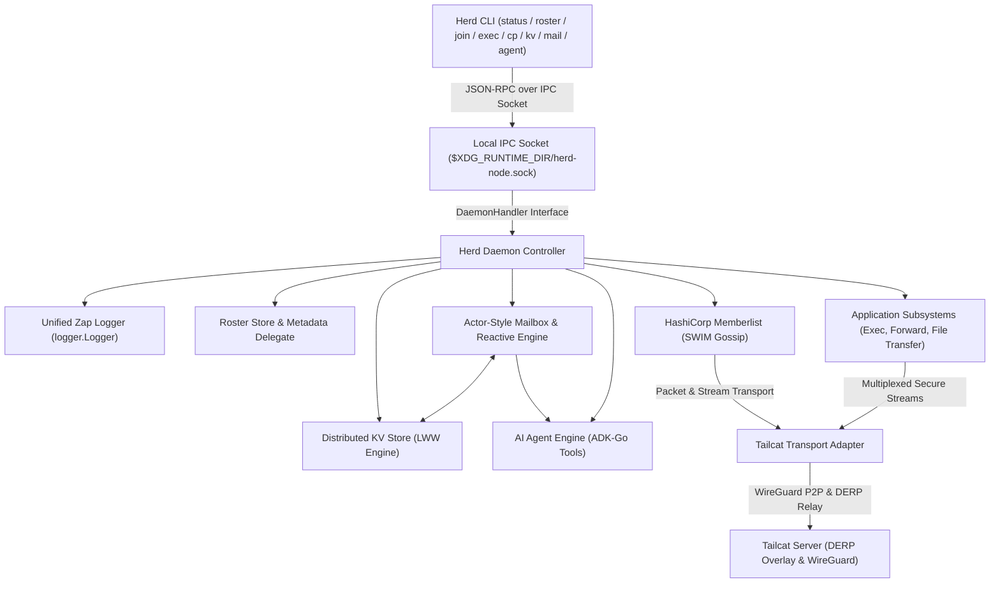

# Herd Architecture

Herd is a lightweight, zero-configuration peer-to-peer mesh clustering daemon and multi-tool CLI built in Go. It enables nodes to form decentralized, secure P2P clusters over WireGuard-powered transports with SWIM gossip membership, local Unix IPC control, and distributed application subsystems.

See also:
- [CLI Commands Reference](commands.md)
- [Actor-Style Mailbox Subsystem](mailbox.md)
- [Unified Logging Architecture](logging.md)
- [Wire Protocol & Transport](protocol.md)
- [Distributed KV Store](distributed-kv.md)
- [Google ADK-Go Integration](adk-integration.md)
- [Testing & Verification](testing-process.md)
- [Cross-Platform & Deployment](cross-platform.md)

---

## 1. System Overview

Herd operates as a **single static binary** that unifies background daemon services and interactive CLI tooling.

---

## 2. Core Components

### 2.1 Daemon Controller (`internal/daemon`)
The central coordinator managing:
- Node lifecycle (`Start`, `Stop`, graceful cluster departures).
- Local Unix domain socket JSON-RPC IPC server.
- Keypair generation and loading from XDG storage.
- Transport initialization, Roster delegate wiring, and distributed KV state synchronizers.

### 2.2 Tailcat Transport Layer (`internal/transport/tailcat`)
Implements `memberlist.Transport` using Tailscale's control-plane-free `github.com/tailscale/tailcat` library:
- **Tailcat DERP Overlay**: Generates a self-contained `tailcat.Addr` string (e.g. `tcpGFw...`) containing Curve25519 node keys, disco keys, and DERP relay region info.
- **NAT Traversal & Magicsock**: Performs automatic STUN and DERP relay bootstrap to establish direct WireGuard UDP tunnels across restrictive firewalls and NATs.
- **Dual-Mode Encryption**: Encrypts gossip packet probes using mutual Curve25519 ECDH Diffie-Hellman keys with ChaCha20-Poly1305 AEAD framing.
- **Stream Multiplexing**: Channels connections by stream header type (`0x01` Gossip, `0x02` Remote Exec, `0x03` Port Forward, `0x04` File Transfer).

### 2.3 Roster & SWIM Gossip (`internal/roster`, `github.com/hashicorp/memberlist`)
- **SWIM Failure Detector**: Periodically probes peers via WAN-tuned failure detectors and updates cluster health.
- **Dynamic Node Metadata**: Synchronizes node names, Tailcat overlay addresses, versions, and tags on peer join/update events.
- **RTT Monitoring**: Continuously tracks round-trip ping latency across active cluster peers.

### 2.4 Distributed Key-Value Store (`internal/kv`)
- **Last-Write-Wins (LWW)**: Resolves concurrent updates deterministically using Lamport logical timestamps and node IDs.
- **Gossip Broadcasts**: Emits live updates across the cluster via memberlist broadcast queues.
- **Anti-Entropy Push/Pull**: Synchronizes full KV state on TCP stream connections and peer join events.

### 2.5 Local IPC Server (`internal/ipc`)
- Exposes local JSON-RPC over Unix domain sockets adhering to `XDG_RUNTIME_DIR`.
- Enables CLI commands (`herd status`, `herd exec`, etc.) to control and query the running daemon with zero network overhead and strict `0600` file permissions.

### 2.6 Actor-Style Mailbox Subsystem (`internal/mailbox`, `internal/daemon`)
- **Decentralized Actor Envelopes**: Asynchronous, brokered-free message envelopes deposited directly into `mailbox:<target>/<msg_id>` via distributed KV.
- **Reactive Watcher Loop**: Background daemon workers monitor incoming mail, auto-acknowledge entries, trigger the embedded AI Agent engine, and symmetrically dispatch replies.
- **Thread & Topic Isolation**: Organizes tasks and conversations across nodes without connection coupling.

### 2.7 Unified Logging Subsystem (`internal/logger`)
- **Abstract Logger Interface**: Standardized [`logger.Logger`](../internal/logger/logger.go) interface wrapping Zap with both structured fields and leveled format methods.
- **Component & Node Namespacing**: Automatic prefixing and tagging (`d.Logger.WithNode(name).Named("component")`).
- **Adapter Bridges**: Pluggable bridges adapting to HashiCorp Memberlist (`ToStdLogger()`) and Tailscale/Tailcat (`Logf()`).

---

## 3. Storage & XDG Directory Layout

Herd adheres strictly to the [XDG Base Directory Specification](https://specifications.freedesktop.org/basedir-spec/basedir-spec-latest.html):

| Data Type | Path | Purpose | Environment Override |
|---|---|---|---|
| **Config** | `~/.config/herd/config.json` | Persistent configuration | `HERD_CONFIG_DIR`, `HERD_CONFIG_FILE` |
| **Identity & Data** | `~/.local/share/herd/identity.key` | Curve25519 private keypair | `HERD_DATA_DIR` |
| **IPC Runtime** | `$XDG_RUNTIME_DIR/herd-<node>.sock` | Daemon control socket | `HERD_SOCKET_PATH`, `HERD_RUNTIME_DIR` |
| **State** | `~/.local/state/herd/` | Logs and state snapshots | `HERD_STATE_DIR` |
