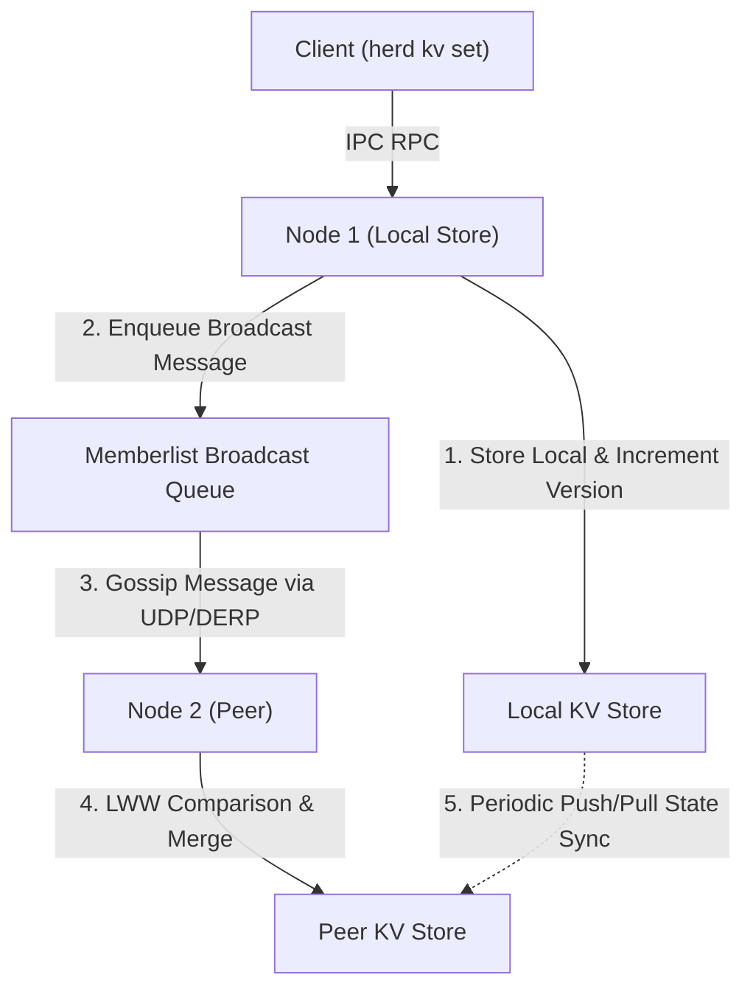

# Distributed Key-Value Store (LWW)

Specification of the distributed in-memory Key-Value store embedded within Herd.

See also:
- [Architecture Overview](architecture.md)
- [CLI Commands Reference](commands.md)
- [Protocol Specification](protocol.md)

---

## 1. Design & Consistency Model

Herd embeds a lightweight distributed key-value store designed for cluster configuration, leader election tokens, and decentralized state coordination.

- **Storage Engine**: Thread-safe in-memory map with versioning.
- **Consistency**: Eventual consistency with **Last-Write-Wins (LWW)** deterministic conflict resolution.
- **Replication**: Hybrid model combining **active gossip broadcasts** and **periodic push/pull anti-entropy exchange**.

---

## 2. Last-Write-Wins (LWW) Conflict Resolution

Every KV entry is represented by a structured record:

```go
type Entry struct {
    Key          string    `json:"key"`
    Value        []byte    `json:"value"`
    Version      uint64    `json:"version"`
    Timestamp    int64     `json:"timestamp"`     // Unix nanoseconds
    WriterNodeID string    `json:"writer_node_id"`
    Tombstone    bool      `json:"tombstone"`
    ExpiresAt    int64     `json:"expires_at"`    // 0 = no expiration
}
```

### 2.1 Conflict Resolution Algorithm

When two updates for the same key conflict across different nodes:
1. **Timestamp Priority**: The update with the higher `Timestamp` wins.
2. **Version Tie-Breaker**: If timestamps are identical, the higher `Version` wins.
3. **Node ID Tie-Breaker**: If both timestamp and version are identical, the entry with the lexicographically larger `WriterNodeID` wins.

```text
Winner = max(EntryA.Timestamp, EntryB.Timestamp)
       || max(EntryA.Version, EntryB.Version)
       || max(EntryA.WriterNodeID, EntryB.WriterNodeID)
```

---

## 3. Replication Lifecycle



### 3.1 Gossip Broadcasts (`internal/kv/broadcast.go`)
- On local write (`Set`) or deletion (`Delete`), an update is enqueued into `memberlist.TransmitLimitedQueue`.
- The broadcast is piggybacked onto gossip packets and sent to randomly selected peers.
- Broadcast retransmissions scale logarithmically with cluster size: $\text{Retransmits} = 3 \times \lceil\log_2(N + 1)\rceil$.

### 3.2 Anti-Entropy Push/Pull Sync (`internal/kv/delegate.go`)
- When nodes open TCP stream connections (`0x01` Gossip) or when a new node joins, full KV state snapshots are exchanged and merged via `LocalState` / `MergeRemoteState`.
- Any missing or outdated keys are caught and reconciled automatically.

### 3.3 Deletions & Tombstone Garbage Collection
- Keys are deleted by writing a tombstone record (`Tombstone = true`).
- Tombstones replicate across the cluster to prevent resurrection of deleted keys during push/pull sync.
- Note that `Store.GC()` is available for manual invocation but is not currently wired to a background goroutine in the daemon.

---

## 4. Key Naming Conventions & Namespace Standards

To prevent collisions between humans, autonomous agents, and system daemons, Herd establishes a formal key naming convention across the distributed store.

### 4.1 Delimiter Syntax
- **Colon (`:`)**: Delimits functional namespaces, domains, and categories (`<namespace>:<domain>:<subdomain>`).
- **Slash (`/`)**: Delimits specific sub-resources, node names, or individual object identifiers (`.../<id>`).

$$\text{Format: } \langle\text{namespace}\rangle\text{:}\langle\text{domain}\rangle[\text{:}\langle\text{subdomain}\rangle]\text{/}\langle\text{identifier}\rangle$$

### 4.2 Reserved Namespaces & Schemas

| Namespace Pattern | Scope | Purpose | Example Key |
|---|---|---|---|
| `mailbox:<target>/<msg_id>` | Node / Cluster | Actor mailbox message envelopes | `mailbox:node-2/msg-1727712000-a1b2` |
| `agent:config:global` | Cluster-wide | Default LLM model, base URL, temperature | `agent:config:global` |
| `agent:config:nodes/<node>` | Per-Node Override | Edge hardware / node-specific agent settings | `agent:config:nodes/rpi5-gateway` |
| `agent:policy:allowed_exec` | Cluster Policy | Whitelist filter for `cluster_exec` commands | `agent:policy:allowed_exec` |
| `agent:memory:<topic>/<key>` | Shared Intelligence | Cross-node agent collaborative knowledge | `agent:memory:network/edge_topology` |
| `agent:prompts:<role>` | Prompt Templates | Standard system prompts for agent roles | `agent:prompts:sre_inspector` |
| `cluster:meta:<node>` | Node Metadata | Dynamic tags, hardware stats, environment | `cluster:meta:node-1` |
| `services:<name>/<instance>` | Service Discovery | Ephemeral registered service endpoints | `services:postgres/primary` |
| `locks:<resource>` | Coordination | Distributed mutual exclusion tokens | `locks:leader_election` |

---

## 5. Standard Payloads & Configuration Examples

All values stored in the reserved namespaces MUST be formatted as valid UTF-8 JSON objects.

### 5.1 Setting Cluster-Wide Agent Parameters (`agent:config:global`)
Configures the primary LLM provider, endpoint, and inference parameters across all mesh agents:

```bash
herd kv set agent:config:global '{
  "provider": "openai",
  "model": "gpt-4o-mini",
  "base_url": "https://api.openai.com/v1",
  "temperature": 0.2,
  "max_tokens": 2048,
  "timeout_seconds": 60
}'
```

For local or edge meshes utilizing Ollama, vLLM, or LiteLLM:
```bash
herd kv set agent:config:global '{
  "provider": "ollama",
  "model": "llama3.2:latest",
  "base_url": "http://192.168.1.100:11434/v1",
  "temperature": 0.1
}'
```

### 5.2 Per-Node Agent Overrides (`agent:config:nodes/<node>`)
Edge nodes with specialized hardware (e.g. Raspberry Pi 5 with local NPU, or Apple Silicon Mac) can override global settings:

```bash
# Direct an edge Raspberry Pi to use a lightweight quantised model
herd kv set agent:config:nodes/rpi5-sensor '{
  "model": "qwen2.5-coder:1.5b",
  "base_url": "http://127.0.0.1:11434/v1",
  "temperature": 0.0
}'
```

### 5.3 Command Execution Security Policy (`agent:policy:allowed_exec`)
Protects nodes from unauthorized or dangerous shell commands executed by AI agents via `cluster_exec`:

```bash
herd kv set agent:policy:allowed_exec '[
  "uptime",
  "df -h",
  "free -m",
  "ps aux --sort=-%cpu | head -n 15",
  "systemctl status *",
  "docker ps --format table {{.Names}}\t{{.Status}}"
]'
```

### 5.4 Storing Agent Collective Intelligence (`agent:memory:<topic>/<key>`)
Agents store findings, discovered topology, or diagnostic incident logs:

```bash
herd kv set agent:memory:incidents/2026-09-network-degradation '{
  "detected_at": "2026-09-30T14:15:00Z",
  "affected_nodes": ["edge-cam-01", "edge-cam-02"],
  "root_cause": "High packet loss over Wi-Fi relay; switched to LTE fallback",
  "resolved": true
}' --ttl 72h
```

### 5.5 Distributed Coordination Locks (`locks:<resource>`)
Distributed mutual exclusion tokens for periodic jobs or leader election:

```bash
# Acquire a lock with a short TTL (e.g. 60 seconds)
herd kv set locks:cert_renewal '{"holder":"node-1","acquired_at":1727712000}' --ttl 60s
```

---

## 6. TTL Guidelines & Expiration Best Practices

Every key in Herd supports an optional Time-To-Live (`--ttl`). Note that `Store.GC()` is available for manual invocation but is not currently wired to a background goroutine in the daemon.

### 6.1 Recommended TTL Allocations

| Data Category | Key Namespace | Recommended TTL | Rationale |
|---|---|---|---|
| Distributed Locks | `locks:*` | `30s` – `60s` | Prevents deadlocks if the lock holder node crashes |
| Mailbox Tasks | `mailbox:*` | `1h` – `24h` | Ensures stale or unacknowledged requests do not accumulate |
| Service Registrations | `services:*` | `2m` – `5m` | Auto-deregisters dead service instances if heartbeat ceases |
| Ephemeral Diagnostics | `agent:memory:incidents/*` | `24h` – `72h` | Retains incident history without permanently ballooning RAM |
| Static Configuration | `agent:config:*`, `agent:policy:*` | `0` (No expiration) | Persists until explicitly modified or deleted |

---

## 7. Operational Best Practices & Anti-Patterns

### 7.1 Anti-Patterns
1. **Un-namespaced Top-Level Keys**: Storing keys like `my_key` or `config` invites collisions between scripts, agents, and other subsystems.
2. **Inconsistent Delimiters**: Mixing underscores and slashes (e.g. `agent_config_global` vs `agent/config/global`). Always follow `<namespace>:<subspace>/<id>`.
3. **Large Binary Blobs**: The KV store is gossip-replicated in-memory. Do not store files or payloads exceeding 64 KB (use `herd cp` for large files).
4. **Omitting TTL on Locks**: Setting locks without a TTL guarantees deadlocks if a node process terminates unexpectedly.

### 7.2 Best Practices
1. **Always Use Atomic JSON**: Ensure JSON payloads can be parsed reliably across Go, Python, and shell scripts.
2. **Namespace by Producer or Domain**: If creating application-specific state, prefix with `app:<app_name>/<key>`.
3. **Use `--prefix` for Scoped Queries**: Query keys efficiently with `herd kv list --prefix "agent:config:"` or `herd kv list --prefix "mailbox:node-1/"`.


