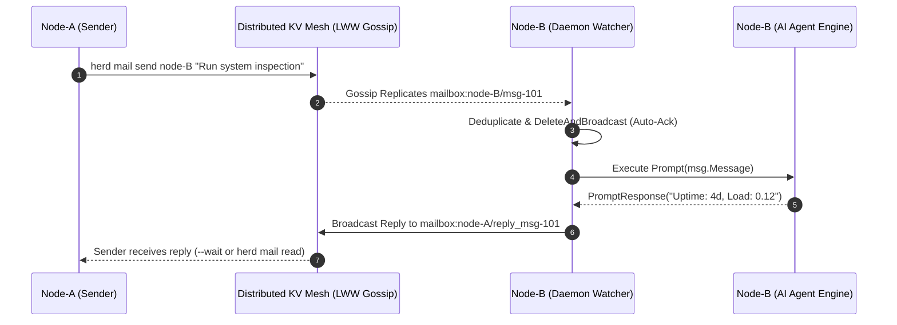
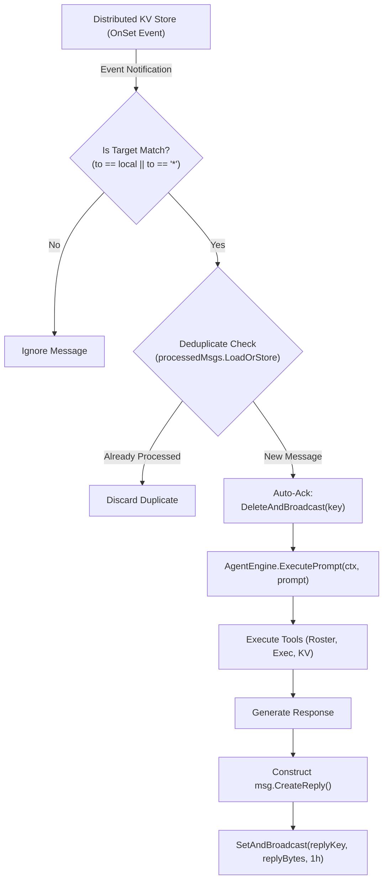

# Actor-Style Mailbox Subsystem

Specification and operational guide for Herd's distributed, actor-style asynchronous Mailbox subsystem.

See also:
- [Architecture Overview](architecture.md)
- [CLI Commands Reference](commands.md)
- [Distributed Key-Value Store](distributed-kv.md)
- [Google ADK-Go Integration](adk-integration.md)

---

## 1. Concept & Actor-Model Architecture

Herd embeds a decentralized, asynchronous actor-style mailbox system. Instead of relying on centralized brokers or point-to-point queues that require both nodes to be connected simultaneously, the mailbox operates directly atop the distributed Last-Write-Wins (LWW) Key-Value gossip layer.

In this model:
- Every mesh node owns a logical **Mailbox** (`mailbox:<target>/*`).
- Senders deposit self-contained message envelopes into target mailboxes without blocking.
- Messages replicate cluster-wide via active gossip broadcasts and anti-entropy synchronization.
- Target nodes reactively detect arrived mail, execute requested tasks using their embedded AI Agent runtime, and symmetrically dispatch replies back to the sender's mailbox.



---

## 2. Message Envelope Specification

All communications are encapsulated inside a standardized JSON message envelope (`internal/mailbox/types.go`):

```json
{
  "id": "msg-1727712000000000000-a1b2",
  "from": "node-1",
  "to": "node-2",
  "topic": "sys_check",
  "thread_id": "thread-1727712000000000000",
  "reply_to": "node-1",
  "message": "Verify disk utilization and report available space",
  "created_at": 1727712000
}
```

### 2.1 Field Reference

| Field | Type | Description |
|---|---|---|
| `id` | `string` | Unique identifier (e.g. `msg-<timestamp_ns>-<random>`). Used for deduplication. |
| `from` | `string` | Sending node name. |
| `to` | `string` | Target destination: node name (`node-2`), group, or broadcast (`*` / `all`). |
| `topic` | `string` | Categorization channel (e.g. `task`, `alert`, `query`, `sys_check`). Default: `general`. |
| `thread_id` | `string` | Conversation grouping identifier for correlating multi-turn exchanges. |
| `reply_to` | `string` | Address where replies should be sent (defaults to `from`). |
| `message` | `string` | Payload body or natural-language prompt for agent execution. |
| `created_at` | `int64` | Unix epoch timestamp in seconds. |

---

## 3. Addressing & Routing Conventions

Mailboxes are mapped directly to distributed KV store keys with the standard pattern:

$$\text{Key} = \text{mailbox:}\langle\text{target}\rangle\text{/}\langle\text{message\_id}\rangle$$

### 3.1 Point-to-Point Addressing
Deposits mail directly into a single target's mailbox:
```text
mailbox:node-2/msg-1727712000000000000-a1b2
```
Only `node-2` processes this task.

### 3.2 Broadcast Addressing (`*` or `all`)
Publishes an announcement or swarm directive to all cluster nodes:
```text
mailbox:*/msg-1727712000000000000-f9e8
```
Every active node in the cluster consumes and processes the message independently.

### 3.3 Symmetric Reply Routing
When responding to a message, the recipient constructs a reply envelope via `msg.CreateReply(localNode, replyContent)`:
- Sets `to` = `msg.ReplyTo` (or `msg.From`).
- Sets `id` = `reply_<original_msg_id>`.
- Inherits `topic` and `thread_id`. Reply envelopes carry the topic `reply:<original-topic>` rather than the original topic unchanged.
- Deposits into `mailbox:<sender>/reply_<original_msg_id>`.

---

## 4. Reactive Agent Engine Loop

The Herd daemon runs an autonomous background watcher loop (`internal/daemon/mailbox_watcher.go`) that links incoming mail directly to the embedded AI agent engine:



1. **Detection**: Whenever a new KV key starting with `mailbox:<node>/` or `mailbox:*/` is stored via gossip, the local daemon's watcher fires.
2. **Deduplication**: In-memory atomic maps guarantee duplicate gossip deliveries are processed exactly once.
3. **Consumption (Auto-Ack)**: The daemon immediately issues `DeleteAndBroadcast(key)` to prevent redundant processing while leaving the tombstone in place.
4. **Execution**: The incoming payload is wrapped into an agent task prompt with topic and thread context, then executed with tool access.
5. **Reply Delivery**: The response is saved to the sender's mailbox with a 1-hour TTL.

---

## 5. CLI Command Reference

Herd provides a dedicated `herd mail` command suite for inspecting and interacting with mailboxes:

### 5.1 `herd mail send <to> <message> [flags]`
Sends a message envelope to a destination node or broadcast channel.

```bash
# Send a basic task to node-2
herd mail send node-2 "Verify docker service status"

# Send with custom topic, thread tracking, and 2-hour TTL
herd mail send node-2 "Run full log audit" --topic audit --thread audit-2026-09 --ttl 2h

# Send and wait synchronously for the recipient agent to reply
herd mail send node-2 "What is your local IP and OS version?" --wait --timeout 30s

# Broadcast an announcement to all cluster nodes
herd mail send "*" "Prepare for cluster upgrade at 18:00 UTC" --topic alert
```

**Flags:**
- `--topic <string>`: Message category/topic (default: `general`).
- `--thread <string>`: Conversation thread ID for correlating replies.
- `--ttl <duration>`: Expiration duration (e.g. `30m`, `2h`, `24h`). Default: `1h`.
- `--wait`: Block until recipient agent posts a reply.
- `--timeout <duration>`: Maximum wait duration (default: `30s`).
- `--socket <path>`: Custom IPC socket path.

---

### 5.2 `herd mail list [flags]`
Lists all pending messages in a mailbox without modifying or deleting them.

```bash
# List local node mailbox
herd mail list

# List messages waiting for a remote node
herd mail list --target node-2

# Output formatted JSON
herd mail list --target "*" --json
```

**Example Output:**
```text
=== Mailbox for node-1 (2 messages) ===
ID:          msg-1727712015-ab12
FROM:        node-2
TOPIC:       sys_check
THREAD:      thread-1727712000
SENT:        15:30:15
MESSAGE:     Uptime is 4 days, 3 hours. All services healthy.
--------------------------------------------------------------------------------
ID:          msg-1727712080-cd34
FROM:        coordinator
TOPIC:       task
THREAD:      thread-1727712080
SENT:        15:31:20
MESSAGE:     Please run database vacuum.
```

---

### 5.3 `herd mail read [flags]`
Reads messages and optionally acknowledges (deletes) them from the mailbox.

```bash
# Read messages without acknowledging
herd mail read

# Read and acknowledge (consume) all pending messages
herd mail read --ack

# Filter by topic and acknowledge
herd mail read --topic audit --ack
```

---

### 5.4 `herd mail watch [flags]`
Continuously monitors and streams incoming messages in real-time as they arrive via gossip.

```bash
# Stream incoming messages for local node
herd mail watch

# Stream incoming messages across all nodes as JSON
herd mail watch --target "*" --json
```

---

## 6. AI Agent Tooling Integration

Embedded agents can invoke mailbox operations autonomously during multi-turn problem solving using built-in ADK tools:

### 6.1 `agent_send_mail`
Enables an agent to delegate sub-tasks to other node agents:
```json
{
  "to": "node-2",
  "topic": "db_query",
  "message": "SELECT count(*) FROM users WHERE status = 'active';",
  "thread_id": "investigation-42"
}
```

### 6.2 `agent_read_mailbox`
Enables an agent to poll its mailbox for results or asynchronous answers:
```json
{
  "topic": "db_query",
  "ack": true
}
```

### 6.3 `agent_broadcast`
Enables an agent to publish state changes or findings across the mesh:
```json
{
  "topic": "leader_elected",
  "message": "node-1 has assumed the coordinator role."
}
```

---

## 7. Performance & Operational Best Practices

1. **Always Set Meaningful TTLs**: Mailbox messages are intended for asynchronous tasks and notifications. Always specify appropriate TTLs (`--ttl 1h` to `--ttl 24h`) so that stale tasks automatically expire from the KV store.
2. **Use Topics for Separation**: Filter by `--topic` rather than inspecting raw message content to keep agent pipelines clean and structured.
3. **Prefer `--wait` for Interactive Shells**: When using `herd mail send` in bash automation, pass `--wait --timeout 30s` to receive the response inline without separate polling loops.
4. **Broadcast Conservatively**: Broadcasting to `*` wakes up every single node agent in the cluster. Use point-to-point addressing whenever a task has an identifiable target node.
