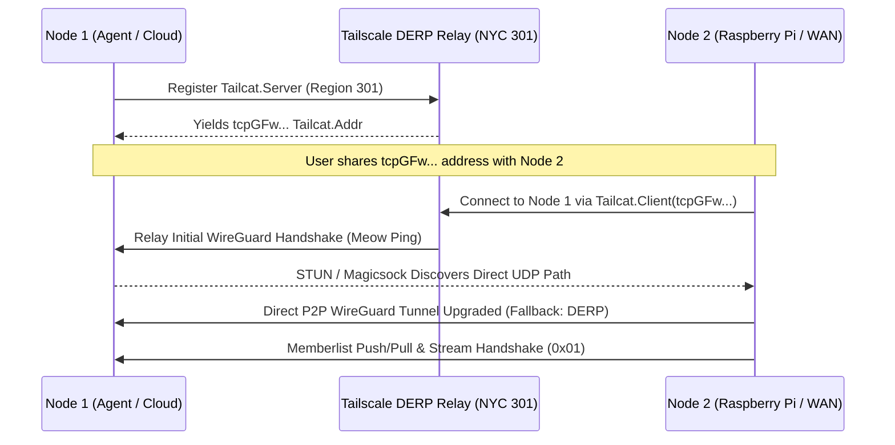

# Herd Wire Protocol & Transport

Technical specification of the cryptographic transport, framing, stream multiplexing, and NAT traversal layers in Herd.

See also:
- [Architecture Overview](architecture.md)
- [Distributed KV Guide](distributed-kv.md)
- [Cross-Platform Guide](cross-platform.md)

---

## 1. Identity & Cryptography

Every Herd node generates a 32-byte Curve25519 keypair persisted securely (`0600`) in `$XDG_DATA_HOME/herd/identity.json`:
- **Private Key**: `x25519.PrivateKey` (32 bytes random entropy).
- **Public Key**: `x25519.PublicKey` (32 bytes).
- **Pre-Shared Discovery Key**: 32-byte cluster shared secret used for initial unseeded gossip encryption before mutual peer keys are established.

### 1.1 Diffie-Hellman Key Derivation
Whenever two nodes open a direct stream or packet exchange, they derive a symmetric session key via **Curve25519 ECDH + HKDF-SHA256**:

$$\text{SharedSecret} = \text{X25519}(\text{LocalPrivKey}, \text{RemotePubKey})$$

$$\text{SessionKey} = \text{HKDF-Extract-and-Expand}(\text{SharedSecret}, \text{info}=\text{"herd-transport-v1"})$$

---

## 2. Stream Multiplexing & Framing

All direct TCP and Tailcat connections initiate with an **Identity & Stream Type Handshake**:

```text
+-----------------------+--------------------+-------------------------+
| Local PubKey (32 B)   | Stream Type (1 B)  | Nonce + Handshake Data  |
+-----------------------+--------------------+-------------------------+
```

### 2.1 Stream Types

| Byte ID | Name | Subsystem Handler | Description |
|---|---|---|---|
| `0x01` | `StreamTypeGossip` | `memberlist.StreamCh` | Push/Pull SWIM state sync and full roster exchange |
| `0x02` | `StreamTypeExec` | `daemon.Daemon.handleExecStream` | JSON-encoded remote command execution and streaming stdio |
| `0x04` | `StreamTypeFile` | `daemon.Daemon.handleFileStream` | Chunked file transfer streaming |
| `0x05` | `StreamTypeAgent` | `daemon.Daemon.handleAgentStream` | Direct encrypted agent-to-agent dialogue and tool delegation |
| `0x06` | `StreamTypePacket` | `t.packetCh` | Reliable framed memberlist gossip datagrams over stream |


### 2.2 Secure Stream Framing
After the handshake, all stream payload frames are encrypted using **ChaCha20-Poly1305 AEAD**:

```text
+-----------------------+---------------------+-------------------------------+
| Length (2 Bytes, BE)  | Nonce (12 Bytes)    | Encrypted Payload + MAC (16B) |
+-----------------------+---------------------+-------------------------------+
```

---

## 3. Tailcat DERP Relay & NAT Traversal

Herd natively embeds `github.com/tailscale/tailcat` to provide zero-infrastructure WAN connectivity:



### 3.1 Tailcat Address Structure (`tailcat.Addr`)
The `tcpGFw...` string encodes:
- **Server WireGuard Node Public Key**
- **Magicsock Disco Public Key**
- **DERP Relay Region ID** (e.g. Region 301 NYC)
- Optional WireGuard Pre-Shared Key (PSK)

### 3.2 Virtual Overlay IPv6 Addressing
Tailcat assigns each node an ephemeral virtual IPv6 address in the `fd7a:115c:a1e0::/48` range. Memberlist advertises this address (`FinalAdvertiseAddr()`), ensuring all nodes communicate over the WireGuard overlay regardless of underlying physical LAN topologies.
