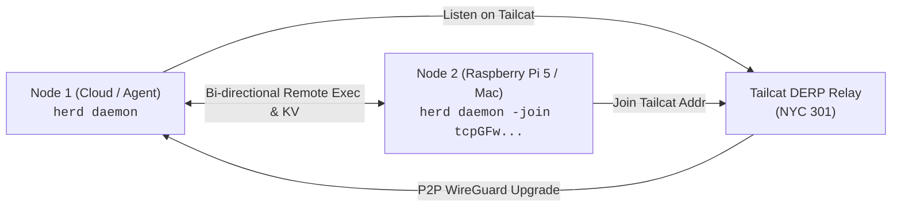

# Herd Testing & Verification Process

Comprehensive guide to testing, verifying, and validating Herd across unit tests, local clusters, and multi-network hardware setups.

See also:
- [Architecture Overview](architecture.md)
- [Actor-Style Mailbox Subsystem](mailbox.md)
- [Unified Logging Architecture](logging.md)
- [CLI Commands Reference](commands.md)
- [Cross-Platform Deployment](cross-platform.md)

---

## 1. Automated Test Suites

Herd includes automated test suites covering all packages with race detection enabled.

### 1.1 Complete Quality Gate (`make check`)
Before committing or publishing releases, run the canonical three-stage quality check:
```bash
# Runs go vet, golangci-lint, and go test -v -race ./...
make check
```

You can also run individual package test suites:
```bash
# Core subsystems
go test -v -race ./internal/transport/tailcat/...
go test -v -race ./internal/kv/...
go test -v -race ./internal/roster/...
go test -v -race ./internal/daemon/...
go test -v -race ./internal/agent/...
go test -v -race ./internal/mailbox/...
go test -v -race ./internal/logger/...
go test -v -race ./docs/...
```

### 1.2 Integration Test Suites (`test/cluster_integration_test.go`)
Runs full multi-node cluster lifecycle tests:
- **Node Join & Convergence**: Validates that 4 independent daemons discover each other and form a consistent roster.
- **KV Replication**: Asserts that keys written on one node replicate to all nodes within gossip convergence thresholds.
- **Mailbox & Actor Reactive Loops**: Tests that messages dispatched to `mailbox:<target>/<id>` wake up the recipient agent, execute tasks, and post replies.
- **Node Departure & Suspect Handling**: Verifies graceful leaves and failover detection when nodes stop responding.
- **Logging Hygiene**: Ensures `logger.NewNop()` suppresses noise during tests while structured loggers accurately capture subsystem and node metadata.

---

## 2. Multi-Node Local Verification Script

Herd provides an automated multi-node cluster verification script at [`scripts/cluster.sh`](../scripts/cluster.sh):

```bash
# Build the binary
make build

# Launch a 4-node local cluster with isolated ports and sockets
./scripts/cluster.sh start 4

# Check cluster status and roster
HERD_NODE_NAME=node-1 ./bin/herd status
HERD_NODE_NAME=node-1 ./bin/herd roster

# Test distributed KV sync
HERD_NODE_NAME=node-1 ./bin/herd kv set cluster/motd "Cluster is operational"
HERD_NODE_NAME=node-4 ./bin/herd kv get cluster/motd

# Test actor mailbox task dispatch with inline reply wait
HERD_NODE_NAME=node-1 ./bin/herd mail send node-3 "Verify local hostname" --wait --timeout 15s

# Test remote execution
HERD_NODE_NAME=node-1 ./bin/herd exec node-3 "uptime"

# Stop the test cluster
./scripts/cluster.sh stop
```

---

## 3. WAN & Cross-Device Hardware Testing (e.g. Raspberry Pi 5 / macOS)

Follow this process to verify zero-infrastructure mesh connectivity across separate physical networks:



### Step 1: Start Bootstrap Node (Node 1)
```bash
HERD_NODE_NAME=node-1 herd daemon
```
Extract the Tailcat address from status:
```bash
HERD_NODE_NAME=node-1 herd status
# Copy the 'Tailcat Addr: tcpGFw...' line
```

### Step 2: Start Target Node (Node 2 / Remote Device)
On the remote device (e.g. Raspberry Pi 5 running `herd-linux-arm64`):
```bash
HERD_NODE_NAME=node-2 ./herd-linux-arm64 daemon -join <tcpGFw...-address-from-node-1>
```

### Step 3: Verify Roster Convergence
On both machines:
```bash
herd roster
```
**Expected:** Both `node-1` and `node-2` show status `alive` with their `fd7a:115c:...` overlay endpoints.

### Step 4: Verify Distributed KV Replication
- On Node 1: `herd kv set test-key "Hello from Node 1"`
- On Node 2: `herd kv get test-key` (returns `"Hello from Node 1"`)

### Step 5: Verify Cross-Node Remote Execution
- From Node 1: `herd exec node-2 "uname -a && uptime"`
- From Node 2: `herd exec node-1 "hostname"`

### Step 6: Verify Actor Mailbox Task Dispatch
- From Node 1: `herd mail send node-2 "Report local hardware model and uptime" --wait --timeout 30s`
- Verify that `node-2` wakes up its agent runtime, executes the prompt, and delivers the answer directly to Node 1's CLI.

